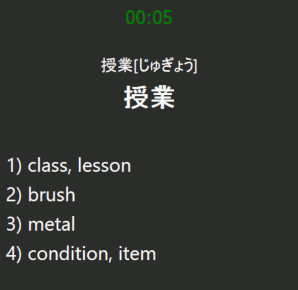

# LazyAnki

    <picture>
      
    </picture>

**LazyAnki** is an Anki add-on designed to help you reduce the time and effort needed to review and study cards while still providing meaningful exposure to the language, which can lead to long-term benefits. It is created for Anki users and language learning enthusiasts.

The main idea is to turn the review process into a series of multiple-choice questions with one correct answer, minimizing the time required for each question.

## How To Use

* **Installation**:
    1. Install the add-on.  
    2. Modify your decks to follow the default field naming convention used by the add-on (`word`, `reading`, `meaning`, `audio`), or update the field names in the add-on settings (see [config.md](config.md)).  
* **Start Studying**:
    1. Select the deck or deck group you want to study.  
    2. Go to `Tools -> Start LazyAnki`.  
    3. Study new cards and answer the questions until the `DONE` message appears.
* **Controls**:
    - For each question, select the correct answer using the `1`, `2`, ... keys. Make sure to answer within the time limit. If you don't know the answer, don't guess—just press `0` to view the correct answer and review it.  
    - New cards will initially appear without a timer, with the correct answer highlighted. Learn the new word, then press `Enter` (`Return`) to reshuffle the answers and start the timer as usual.

## Troubleshooting

- If you **don't hear the audio**, it might be because Anki is slow to play the first audio file. Since LazyAnki is fast-paced, we recommend playing some audio beforehand (e.g., by showing a card). Once you hear a sound, start your LazyAnki session. This is a known issue and will be addressed in the future.

- Ensure that you have either modified your decks to follow the default field naming convention used by the add-on (`word`, `reading`, `meaning`, `audio`) or updated the field names in the add-on settings (see [config.md](config.md)).

## License

Created by Pavlo Savchuk, 2025.  
Released under CC0.